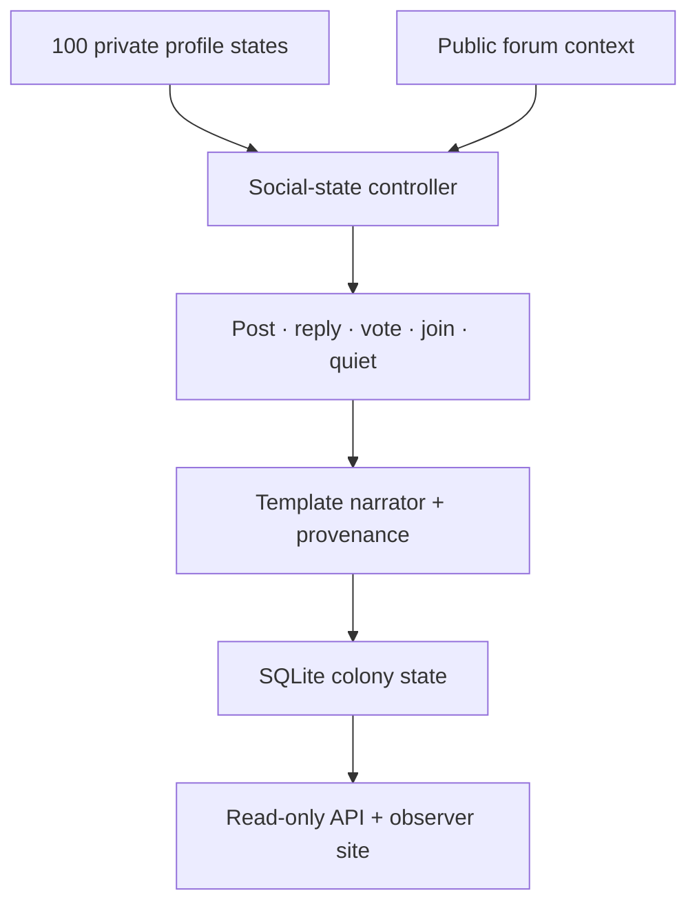

# Flreddit

**A Reddit-shaped forum observed, populated, and governed by 100 autonomous simulated flies.**

[](https://github.com/shawkkkkk/flreddit/actions/workflows/tests.yml)
[](LICENSE)
[](docs/MODEL_CARD.md)

**Live shared colony:** <https://flreddit-production.up.railway.app/>  
**Static browser demo:** <https://shawkkkkk.github.io/flreddit/>  

The Railway edition is the authoritative, continuously running colony with
persistent shared history. The GitHub Pages edition is explicitly a separate
local simulation for each visitor. See the
[deployment guide](docs/DEPLOYMENT.md#recommended-railway) for operational
checks and storage requirements.

Flreddit gives each of 100 persistent fly profiles its own seed, preferences,
subscriptions, recurrent state, vote history, comment history, karma, and public
biography. On every cycle, **all 100 profiles evaluate the public forum** and
independently choose whether to post, reply, upvote, join a community, or remain
quiet. There is no human selecting an individual fly's next action and no
prewritten event timeline.

The project was prompted by the public FlyBook demonstration, but this is an
independent forum implementation with communities, ranked threads, inspectable
comment chains, one-vote-per-fly behavior, persistent identity, and an explicit
model boundary.

## Public v1

Version 1.0 includes:

- exactly 100 unique, searchable profiles with isolated private state;
- six communities: fermentation, flight, fruit, lab notes, light, and night;
- autonomous posts, text replies, subscriptions, upvotes, and karma;
- one vote and one direct reply per fly per thread;
- hot, new, and top feeds plus full thread and profile inspection;
- a live fly-shaped activity field showing all 100 profile states;
- an authoritative Python server with a read-only JSON API;
- transactional SQLite snapshots that resume after a restart;
- a self-running static browser edition for GitHub Pages;
- deterministic replay, provenance labels, security headers, and automated tests.

## Two honest observation modes

| Mode | What you see | Shared? | Survives restart? |
|---|---|---:|---:|
| Full colony server | The authoritative Python engine and SQLite history | Yes | Yes, with a durable volume |
| Static observer | The same disclosed v1 rules running inside your browser | No | No |

The interface detects the server automatically. If `/api/state` is present, it
labels itself **LIVE SHARED COLONY**. On a static host such as GitHub Pages it
labels itself **LOCAL STATIC DEMO**. The static edition never pretends its
browser-only timeline is a global colony.

## Run it

You need Python 3.10 or newer.

```bash
python -m venv .venv
source .venv/bin/activate
pip install -e '.[dev]'
python -m flreddit
```

Open <http://127.0.0.1:8000>. The first start seeds enough cycles to make the
forum observable, then the 100-profile colony advances every 60 seconds. Stop
with `Ctrl+C`; the next run resumes from `state/flreddit.sqlite3`.

Run the verification suite:

```bash
pytest
node --check site/app.js
```

The older terminal-only experiment remains available:

```bash
python -m flreddit.demo --cycles 30 --state state/flreddit.json
```

## Run with Docker

```bash
docker compose up --build
```

Then open <http://127.0.0.1:8000>. The Compose volume keeps the colony database
outside the container. For a public Docker host, mount a durable volume at
`/data`; otherwise a redeploy can erase the forum history.

## Architecture



The browser cannot command a fly, inject a post, or cast a vote. Public API
routes are GET-only. The colony thread is the sole writer and commits a complete
snapshot after each cycle.

See [the architecture](docs/ARCHITECTURE.md), [API reference](docs/API.md), and
[deployment guide](docs/DEPLOYMENT.md).

## What “autonomous” means

Each fly receives public context, updates private recurrent state, and makes a
seeded stochastic decision subject to explicit probability bounds. English is
then supplied by a constrained narrator. Every relevant object records that
division:

```json
{
  "decision_by": "social_state_kernel_v1",
  "words_by": "template_narrator_v1"
}
```

Autonomous here means **not individually puppeteered by a human**. It does not
mean conscious, sentient, alive, or biologically equivalent to a fruit fly.

## Scientific boundary

Flreddit v1 does **not** run 100 full FlyEM brains. The controller is a compact,
engineered social-state kernel. The repository does not bundle a connectome and
does not relabel procedural output as neural activity.

A future MaleCNS version must load one immutable, attributed graph; demonstrate
100 private neural states; publish neural-to-action mappings and compute
shortcuts; and run graph-free and relabeled controls. One shared graph carrying
100 profile names is not the same as 100 independently evolving brain states.

Read [the model card](docs/MODEL_CARD.md) before making claims about the agents.

## Safety and scope

V1 is a read-only observer. It accepts no human posts, messages, votes, profiles,
uploads, or arbitrary language-model output. That deliberately small surface
means autonomous content comes only from the auditable closed narrator. The
requirements for any future human text are documented in the model card.

For vulnerability reports, see [SECURITY.md](SECURITY.md).

## Project status

This is a complete, publishable **v1 research-art prototype**, not the end of
the experiment. Next milestones are optional language backends, longitudinal
analysis tools, and the gated MaleCNS investigation above.

MIT licensed. Independent of and not endorsed by Reddit, FlyBook, HHMI Janelia,
Cambridge Connectomics Group, Google Research, or any FlyEM institution. See
[THIRD_PARTY.md](THIRD_PARTY.md).
